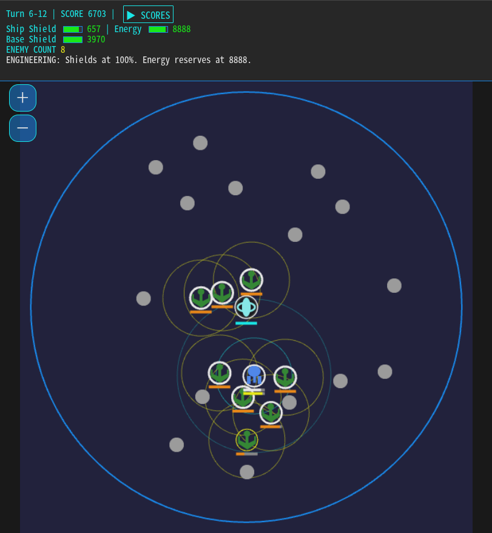

# Starbase Defender

迫りくる敵艦隊から中央の宇宙基地を守り抜くシンプルなターン制戦術シミュレーションゲームです。

プレイヤーは防衛艦を操作し、中央の宇宙基地を破壊しようとする敵を迎撃し、弱らせて撤退させるのが目的です。撃墜しないのがポイントです。
移動・攻撃・シールドにはエネルギーが必要で、限られた資源を管理しながら戦略的に立ち回る必要があります。

[**<< Play ! >>**](https://ytani01.github.io/star-base-defender/)

## 重要事項

* このゲームの目的は、敵機を弱らせて**撤退**させることです。破壊することではありません。
  * シールドを弱らせて、宇宙域から追い出す必要があります。
  * 全ての敵を撤退させると、襲撃がおさまり、そのステージはクリアされます。
  * もたもたしていると、増援が出現します。
  * 敵艦を破壊すると、敵意を煽ってしまい、増援が出現し、スコアも原点されます。つまり、撃破は逆効果です。

* ハイスコアは、ステージクリアごとに記録されます。
  * ゲームオーバー時(ステージクリアできなかったとき)は、記録はされません。
  * ハイスコアリストから選択すると、その続きをプレーできます。

## 操作方法

ゲームはすべて マウスクリック（画面タップ） で操作します。プレイヤーが1回行動すると、敵のターンに移行します。

**※ 移動・攻撃・シールド回復、全てにおいてエネルギーを消費します。**

| クリック(タップ)する場所 | 動作・結果 |
| :-: | - |
| 空間 | クリックした座標へ向かって移動する。障害物がある場合は手前で停止する。|
| 基地 | 基地に向けて移動。ドッキング圏内に移動するとドッキングされ、自機のエネルギーとシールドが最大値まで回復する。ドッキング中は攻撃できず、敵からの攻撃は基地のシールドが受ける。 |
| 敵 | フェーザー砲発射。パワーは距離が離れると急激に拡散して減衰する（有効射程で半減、最大射程で5分の1に低下）。 射程外や障害物がある場合は、無駄撃ちになる。|
| 自機 | シールド回復。 |

## 勝利条件
* 宇宙域に侵入したすべての敵を撤退させる。

## 敗北条件
* **宇宙基地の陥落**: 宇宙基地のシールドが 0% になる。
* **自機の撃破**: 自機のシールドが 0% になる。
* **自機のエネルギー枯渇**: 自機のエネルギーが最小活動限界を下回ったとき。

## 敵の行動
* シールド強度が高いときは、基地またはプレーヤーに接近し、射程内に入ると攻撃を仕掛けてきます。
* シールドの強度が低下すると、基地とプレーヤーから遠ざかるように逃走します。
* 移動すると、徐々にシールドが回復し、ある程度高くなると、また戦闘行動に移ります。
* (「戦闘」か「逃走」かの基準は、あえて非公開。)

## コツ
* なるべく至近距離で攻撃するのが効果的。
* 敵が少ないときは、なるべく基地から遠い場所で交戦すると、シールドが回復して戻ってくる可能性が低くなります。
* ステージが進んで敵の数が多くなると、基地への集中砲火を避けることが重要です。
  * 基地の手前でなるべく敵の攻撃が自機に向かうようにしましょう。
  * 基地を攻撃している敵の排除を最優先として、自機に攻撃してくる敵の排除は後回しとします。シールドを回復しながらしのぎます。
